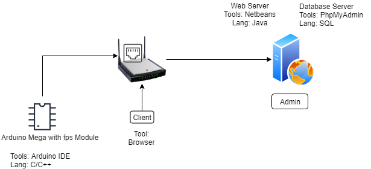

<h1 align="center">
	
	 
	C E R B E R U S
	 
	Remote Fingerprint Attendance System
</h1>

Hardware used :
>- <a href="www.google.com">Arduino Mega 2560 R3</a>
>- GT511C3
>- 2004 Character Display
>- ENC28J60
>- DS1307
>- SD Card Module
>- Buzzer
>- A Few LEDs

### Architecture of the system
<h1 align="center">
	
	 
	 
</h1>

### Flow of the RaspberryPI
<h1 align="center">
	
	 
	 
</h1>

